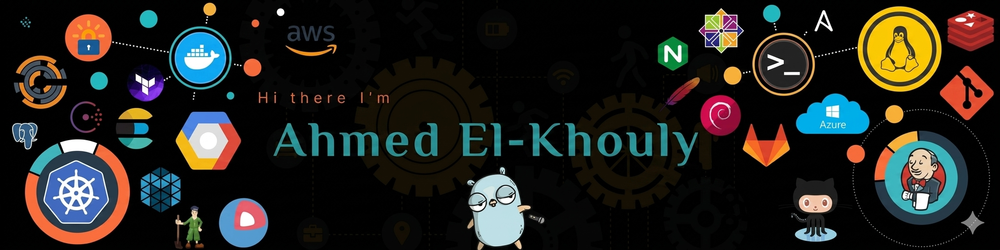

# Hi, I'm Ahmed El-Khouly 👋
### 🚀 Backend Python Developer

  
 

<!--  -->

---

# 💫 About Me

- 🧠 Currently learning **Backend Development**
- ⚙️ Focused on **Django & Django REST Framework**
- 🔥 Interested in building APIs and scalable backend systems
- 🐧 Linux user and open-source enthusiast
- 🌱 Currently improving my skills in:
  - REST APIs
  - Authentication & Authorization
  - Databases
  - Deployment
  - Clean Code
  - Git & GitHub

---

# 🛠️ Tech Stack

  

---

# 📚 Currently Learning

- Django REST Framework
- API Authentication (JWT)
- PostgreSQL
- Docker
- Deployment & Linux Servers
- Software Architecture Basics

---

# 📊 GitHub Stats

<!--  -->
<!--  -->
  

---

